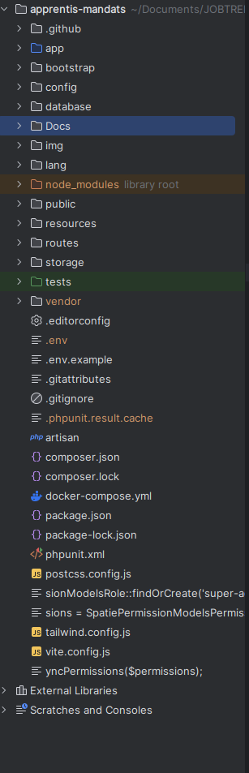

# Architecture

Le projet est basé sur le framework Laravel, avec l'outil Filament pour la gestion de l'interface utilisateur. L'application est déployée dans un container Docker pour faciliter la gestion des dépendances et l'environnement d'exécution.

## Structure du Projet

- `app/` : Contient le code de l'application Laravel.
- `database/` : Contient les migrations, les factories et les seeders.
- `public/` : Le répertoire public pour les assets.
- `resources/` : Les vues et les assets non compilés.
- `routes/` : Les définitions des routes de l'application.
- `Dockerfile` : Le fichier de configuration pour Docker.

## l'Architecture

