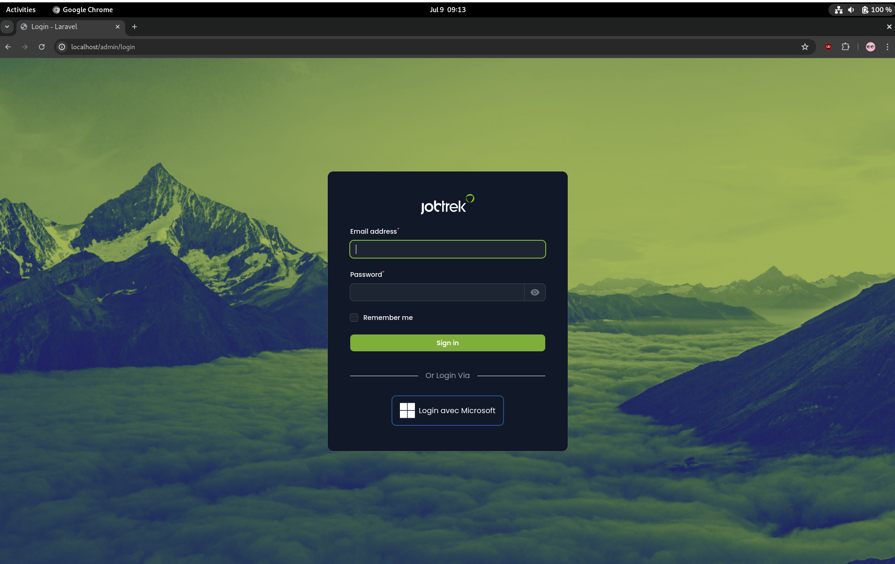
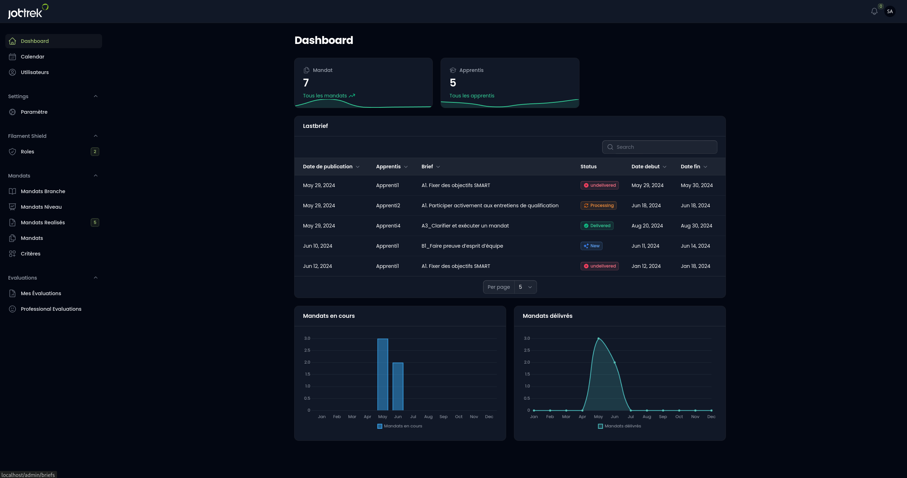
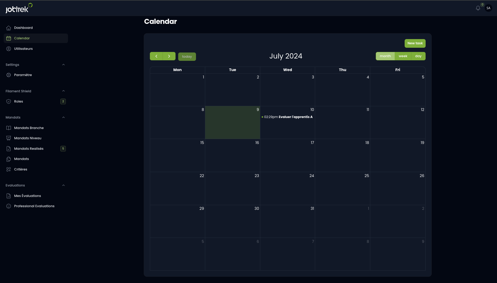
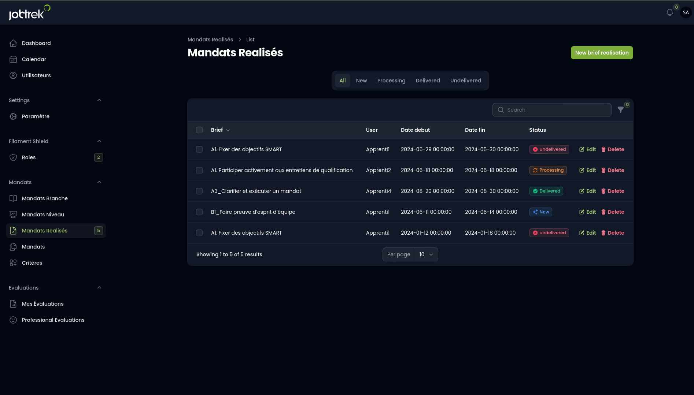
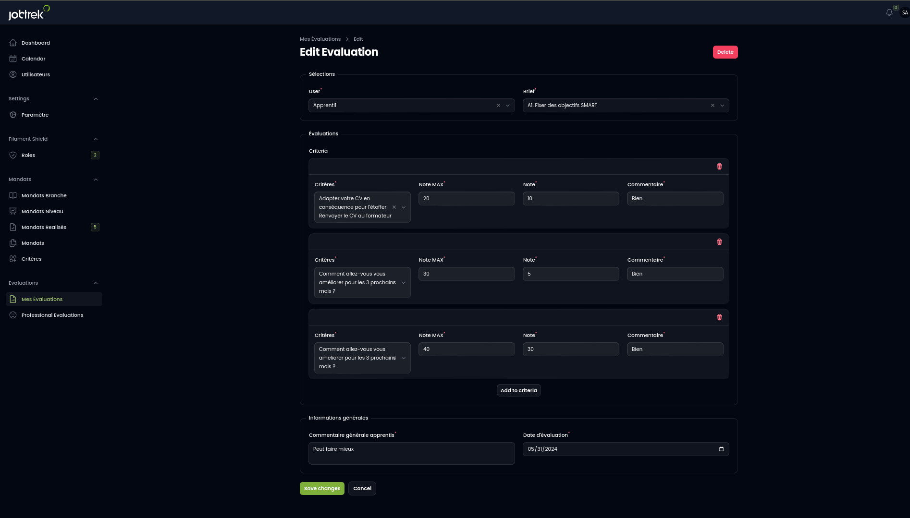

# Guide d'Utilisation

Cette section explique comment utiliser les principales fonctionnalités de l'application.

## Connexion

1. Accédez à la page de connexion via `http://localhost`.
2. Entrez vos identifiants et cliquez sur "Connexion".

## Tableau de Bord

Le tableau de bord présente une vue d'ensemble des apprentis et des mandats dans le projet.

Vous y trouverez une liste des derniers mandats associés aux apprentis, avec leur statut. En bas, des statistiques vous permettent de visualiser les mandats en cours et les mandats livrés.

## Les Ressources

1. **Calendrier** : Un calendrier permettant d'ajouter des rendez-vous ou des événements.
2. **Page Utilisateurs** : Une page listant tous les utilisateurs.
3. **Page Paramètres** : Une page en cours de développement pour ajouter des paramètres au site.
4. **Rôles** : Une page permettant de gérer les accès des utilisateurs connectés.
5. **Section Mandats** :
    - **Branches de Mandat** : Gestion des différentes branches de mandat.
    - **Niveaux** : Gestion des différents niveaux de mandats.
    - **Mandats Réalisés** : Association des mandats aux apprentis, avec quatre statuts possibles pour suivre les mandats en cours, livrés, non livrés et nouveaux.

    - **Critères** : Possibilité d'associer des critères aux mandats.

6. **Section Évaluations** : Permet aux formateurs d'évaluer les apprentis en ajoutant des critères, des notes et des commentaires, et de calculer la moyenne des évaluations.

